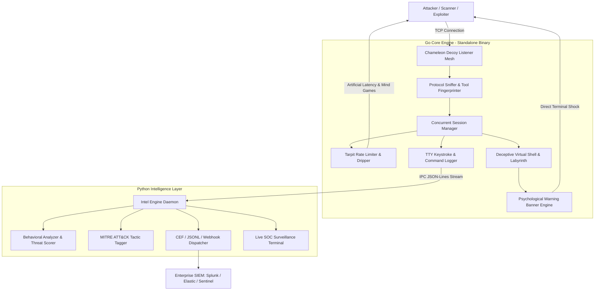

# Chameleon Honeypot — Enterprise Cyber Deception & Psychological Tarpit

```
   _____ _    _          __  __ ______ _      ______ ____  _   _ 
  / ____| |  | |   /\   |  \/  |  ____| |    |  ____/ __ \| \ | |
 | |    | |__| |  /  \  | \  / | |__  | |    | |__ | |  | |  \| |
 | |    |  __  | / /\ \ | |\/| |  __| | |    |  __|| |  | | . ' |
 | |____| |  | |/ ____ \| |  | | |____| |____| |___| |__| | |\  |
  \_____|_|  |_/_/    \_\_|  |_|______|______|______\____/|_| \_|
        Enterprise-Grade Cyber Deception & Psychological Tarpit
```

**Chameleon** is a next-generation cross-platform (Linux & Windows) cyber deception and psychological countermeasure platform. Built with a dual-language hybrid architecture, Chameleon merges raw low-level networking performance with advanced behavioral intelligence and active psychological counter-measures.

---

## Architecture Overview


⚙️ Go Core Engine

The Go engine provides the low-level networking and session-management layer.

High Concurrency

Concurrent TCP session handling

Lightweight goroutines

Minimal runtime overhead

Graceful shutdown and session management

Standalone executable deployment

Multi-Port Decoy Mesh

Chameleon can expose multiple deceptive services simultaneously, including:

SSH-style listeners

Telnet-style listeners

Custom interactive consoles

Configurable custom ports

Example:

22    → SSH deception
2222  → Alternate SSH deception
23    → Telnet deception
2323  → Alternate Telnet deception
9999  → Interactive custom console

Protocol & Tool Fingerprinting

The engine observes connection behavior, probes, payload patterns, command sequences, and timing characteristics to help distinguish between:

AUTOMATED_SCANNER
EXPLOIT_BOT
HUMAN_INTERACTIVE

Dynamic Tarpit

Instead of immediately terminating suspicious sessions, Chameleon can introduce controlled delays and progressively slower responses.

This can:

Consume attacker or scanner resources

Slow automated interaction

Increase session duration

Generate additional behavioral telemetry

Provide analysts with more observable activity

🧠 Python Intelligence Layer

The Python layer processes behavioral telemetry generated by the Go engine.

Real-Time Threat Scoring

Each session can receive a dynamic threat score:

0.0 ───────────────────────────── 10.0
Low                              Critical

Scoring can consider:

Command complexity

Suspicious payloads

Exploitation attempts

Privilege escalation behavior

Reconnaissance activity

File access attempts

Session interaction patterns

🔍 Attacker Classification

Chameleon analyzes interaction behavior to classify potential attackers as:

AUTOMATED_SCANNER

Examples include:

Nmap
Masscan
ZGrab
Shodan-style probing

EXPLOIT_BOT

Examples include:

Automated exploit payloads
Droppers
Brute-force automation
Rapid command bursts

HUMAN_INTERACTIVE

Behavior can include:

Variable keystroke timing
Typing pauses
Interactive command sequences
Manual exploration

🧬 MITRE ATT&CK Mapping

Suspicious activity can be mapped to relevant MITRE ATT&CK techniques.

Examples include:

Technique

Description

T1082

System Information Discovery

T1003

OS Credential Dumping

T1059

Command and Scripting Interpreter

T1105

Ingress Tool Transfer

T1070

Indicator Removal

The resulting telemetry can be forwarded to security monitoring infrastructure for further analysis.

🧠 Psychological Countermeasures & Active Deception

Chameleon is designed not only to detect interaction, but also to create a convincing deceptive environment.

1. Immediate Psychological Shock

The system can display a warning when suspicious interaction begins:

================================================================================
[!] CRITICAL SYSTEM ALERT: ACTIVE PROFILING ENGAGED
================================================================================
[+] TIMESTAMP        : 2026-10-08 21:15:30 UTC
[+] INTRUDER IPv4    : <ATTACKER_TRUE_IP>
[+] ORIGIN PORT      : 54322
[+] PROTOCOL INGRESS : SSH-PROBE
[+] AUDIT SIGNATURE  : TRACE-NODE#7A9E21DF48
--------------------------------------------------------------------------------
[*] DYNAMIC ROUTE TRACING (LIVE HOP ANALYSIS):
    HOP 01: [INGRESS]    <ATTACKER_TRUE_IP>:54322 -> SYN_ACK CAPTURED
    HOP 02: [ISOLATION]  GATEWAY SINK-PROXY [HARDWARE TRAP ONLINE]
    HOP 03: [TELEMETRY]  PACKET DUMP & TTY BUFFER FORWARDED TO SOC/CSIRT
--------------------------------------------------------------------------------
>>> You're being watched — Tonight is the night <<<
--------------------------------------------------------------------------------
[!] FORENSIC ISOLATION ACTIVE. YOUR SESSION IS ARCHIVED IN REAL-TIME.
================================================================================

Strict Banner Anonymity

The psychological warning banner itself contains:

No developer names

No GitHub handles

No personal attribution

Project attribution remains exclusively in the documentation and project metadata.

🕳️ Tarpit & Deception Mechanics

Progressive Latency

The system can introduce controlled response delays that increase as the session continues.

Labyrinth Traps

Deceptive directory structures can create the appearance of a larger environment:

/root/vault/sub_sector_3/quarantine

Honeytoken Bait Files

Example deceptive targets:

id_rsa
/etc/shadow
database_production.conf
emergency_access.txt

These can be used as interaction triggers and telemetry sources.

Containment Deception

Potentially destructive commands can be intercepted and handled inside the simulated environment rather than being executed against the underlying host.

Examples:

exit
quit
rm -rf
reboot

📁 Project Structure

chameleon-honeypot/
├── cmd/
│   └── chameleon/
│       └── main.go                 # Go CLI entrypoint & flag parser
│
├── internal/
│   ├── config/
│   │   └── config.go               # Configuration manager & defaults
│   │
│   ├── core/
│   │   ├── engine.go               # Master orchestrator & graceful shutdown
│   │   └── session.go              # Session registry & state tracking
│   │
│   ├── listener/
│   │   ├── listener.go             # High-concurrency TCP listener pool
│   │   ├── protocol_detector.go    # Protocol detection & fingerprinting
│   │   └── tarpit.go               # Streaming tarpit & rate limiter
│   │
│   ├── deception/
│   │   ├── banner.go               # Psychological warning generator
│   │   ├── mindgames.go            # Labyrinths, honeytokens & fake outputs
│   │   └── shell.go                # Deceptive interactive shell
│   │
│   ├── profiler/
│   │   ├── fingerprint.go          # Scanner vs human behavior analysis
│   │   └── tty_logger.go           # Keystroke-level forensic recorder
│   │
│   └── ipc/
│       └── streamer.go              # IPC bridge to Python
│
├── python_intel/
│   ├── intel_engine.py             # Python intelligence daemon
│   ├── behavioral_analyzer.py      # Behavioral scoring & ATT&CK mapping
│   ├── alert_dispatcher.py         # CEF/SIEM & webhook dispatcher
│   ├── terminal_monitor.py         # Live SOC surveillance console
│   └── tests/
│       └── test_intel.py           # Python intelligence tests
│
├── config/
│   └── config.json                 # Deployment configuration
│
├── deploy/
│   ├── chameleon.service           # Linux systemd service
│   ├── run_chameleon.sh            # Linux daemon manager
│   ├── run_chameleon.bat           # Windows launcher
│   └── install_windows_service.ps1 # Windows service installer
│
├── test/
│   ├── attacker_simulator.py       # Automated attacker simulator
│   └── honeypot_test.go            # Go test suite
│
├── Makefile                        # Build & test automation
└── README.md                       # Project documentation

🚀 Installation & Quickstart

If this is your first time using Go or GitHub projects, follow the steps below.

Prerequisites

Make sure you have:

Go 1.22+

Python 3.10+

Git

Make

The Python intelligence layer uses the Python standard library and does not require external pip packages.

1. Clone the Repository

git clone https://github.com/cys-dexter/chameleon-honeypot.git
cd chameleon-honeypot

2. Build Chameleon

Build the project:

make build

The resulting executable will be created under:

bin/chameleon

On Windows:

bin/chameleon.exe

Build Multi-Platform Binaries

To build both Linux and Windows targets:

make build-all

Or build individually:

make build-linux
make build-windows

Expected outputs:

bin/chameleon-linux-amd64
bin/chameleon-windows-amd64.exe

🧪 Run Tests

Run the complete test suite:

make test

This runs the Go and Python test suites.

The Go tests include race detection:

go test -v -race ./test/...

The Python intelligence tests can be run with:

python3 -m unittest discover -s python_intel/tests

▶️ Start Chameleon

Linux

./bin/chameleon -c config/config.json

Windows

bin\chameleon.exe -c config\config.json

You can also override ports directly:

./bin/chameleon -p 2222,2323,9999

🧪 Attacker Simulation & Verification

Chameleon includes an automated attacker simulator for local verification.

Open a second terminal while the honeypot is running and execute:

python3 test/attacker_simulator.py 9999 127.0.0.1

The simulator can verify multiple interaction scenarios.

1. Automated Scanner

Tests scanner-style probes and verifies classification as:

AUTOMATED_SCANNER

2. Exploit Bot

Simulates rapid suspicious payload delivery and verifies:

EXPLOIT_BOT

along with relevant behavioral and MITRE telemetry.

3. Human Interactive Attacker

Simulates human-like typing delays and verifies:

You're being watched — Tonight is the night

It can also verify:

Attacker IP capture

Session recording

Tarpit response delays

Behavioral analysis

📝 Evidence & Forensic Logs

Chameleon maintains multiple telemetry formats.

logs/
├── chameleon_events.jsonl
├── evidence_intel.jsonl
├── siem_events.cef
└── sessions/
    └── <session_id>.log

chameleon_events.jsonl

Real-time event stream generated by the Go engine.

sessions/<session_id>.log

Session-level forensic records, including command and interaction telemetry.

evidence_intel.jsonl

Behavioral intelligence, threat scores, and MITRE ATT&CK mappings.

siem_events.cef

Common Event Format records suitable for SIEM ingestion.

🖥️ Live SOC Surveillance

The Python intelligence layer includes a live monitoring console.

Run:

python3 python_intel/terminal_monitor.py logs

The console can display live information such as:

Attacker IP
Session ID
Commands
Keystroke activity
Tool classification
Threat score
MITRE ATT&CK tags

🕒 24/7 Always-On Deployment

Chameleon can run continuously in the background without keeping an interactive terminal open.

🐧 Linux — systemd

1. Create the deployment directory

sudo mkdir -p /opt/chameleon-honeypot/bin

Copy the binary:

sudo cp bin/chameleon /opt/chameleon-honeypot/bin/

Copy the configuration:

sudo cp -r config /opt/chameleon-honeypot/

2. Install the systemd service

sudo cp deploy/chameleon.service /etc/systemd/system/

3. Reload systemd

sudo systemctl daemon-reload

4. Enable and start Chameleon

sudo systemctl enable --now chameleon.service

This configures Chameleon to start automatically with the system.

5. Check service status

sudo systemctl status chameleon.service

🐧 Linux — Daemon Script

Chameleon also includes a management script.

Start

./deploy/run_chameleon.sh start

Check Status

./deploy/run_chameleon.sh status

Stop

./deploy/run_chameleon.sh stop

This provides a simple alternative to manually managing the process.

🪟 Windows — Background Service

Chameleon can be installed as a Windows service.

1. Open Administrator PowerShell

Right-click PowerShell and select:

Run as Administrator

2. Navigate to the project

cd path\to\chameleon-honeypot

3. Install the service

.\deploy\install_windows_service.ps1 -Action install

4. Check service status

Get-Service -Name ChameleonHoneypot

5. Uninstall the service

When required:

.\deploy\install_windows_service.ps1 -Action uninstall

🔐 Deployment Notes

For real-world deployment, Chameleon should ideally be placed inside an isolated security environment.

Recommended architecture:

Internet
    │
    ▼
Firewall / Gateway
    │
    ▼
┌───────────────────────┐
│   Chameleon Honeypot  │
│                       │
│  Deception Layer      │
│  Tarpit               │
│  Session Recording    │
│  Intelligence Engine  │
└───────────┬───────────┘
            │
            ▼
     SOC / SIEM / CSIRT

Avoid exposing sensitive host resources to the deceptive environment. The honeypot should be treated as an intentionally exposed security sensor.

📊 Enterprise Telemetry Flow

Attacker
   │
   ▼
Decoy Listener
   │
   ▼
Session Manager
   │
   ├──► Protocol Detection
   │
   ├──► Tool Fingerprinting
   │
   ├──► TTY Recording
   │
   └──► Deceptive Shell
            │
            ▼
      JSONL IPC Stream
            │
            ▼
    Python Intelligence
            │
      ┌─────┼─────────┐
      ▼     ▼         ▼
   Threat  MITRE     Alerts
   Score   Mapping   / CEF
      │     │         │
      └─────┴─────────┘
              │
              ▼
          SOC / SIEM

🛡️ Security Philosophy

Chameleon is designed around a simple principle:

Don't just detect the intruder — make the intruder interact with the deception.

Instead of immediately rejecting every suspicious connection, the platform can maintain a controlled deceptive environment where attacker behavior becomes observable.

This creates opportunities for:

Extended behavioral observation

Tool fingerprinting

Command collection

Attack-pattern analysis

Threat scoring

MITRE ATT&CK classification

SIEM integration

Forensic investigation

⚠️ Responsible Use

Chameleon is intended for:

Authorized security research

Defensive security monitoring

Honeypot deployments

Malware and attacker-behavior analysis

SOC/CSIRT research environments

Network defense laboratories

Controlled penetration-testing environments

Only deploy the honeypot on systems and networks you own or have explicit authorization to monitor.

👤 Project

Chameleon Honeypot

Creator: Ahmad
Security Identity: CYS-Dexter
GitHub: cys-dexter

Repository:

https://github.com/cys-dexter/chameleon-honeypot

🚀 Quick Start — TL;DR

git clone https://github.com/cys-dexter/chameleon-honeypot.git
cd chameleon-honeypot
make build
./bin/chameleon -c config/config.json

Then, from another terminal:

python3 test/attacker_simulator.py 9999 127.0.0.1

For 24/7 Linux deployment:

sudo mkdir -p /opt/chameleon-honeypot/bin
sudo cp bin/chameleon /opt/chameleon-honeypot/bin/
sudo cp -r config /opt/chameleon-honeypot/
sudo cp deploy/chameleon.service /etc/systemd/system/
sudo systemctl daemon-reload
sudo systemctl enable --now chameleon.service
sudo systemctl status chameleon.service

Chameleon is now ready to operate as a controlled cyber-deception sensor. keystrokes, active tool classifications, and threat scores.
