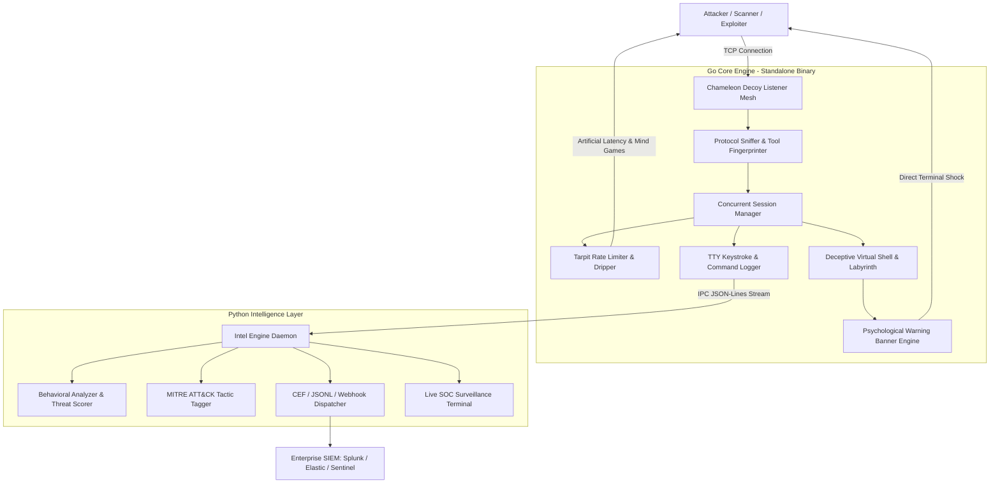

# Chameleon Honeypot — Enterprise Cyber Deception & Psychological Tarpit

```
   _____ _    _          __  __ ______ _      ______ ____  _   _ 
  / ____| |  | |   /\   |  \/  |  ____| |    |  ____/ __ \| \ | |
 | |    | |__| |  /  \  | \  / | |__  | |    | |__ | |  | |  \| |
 | |    |  __  | / /\ \ | |\/| |  __| | |    |  __|| |  | | . ' |
 | |____| |  | |/ ____ \| |  | | |____| |____| |___| |__| | |\  |
  \_____|_|  |_/_/    \_\_|  |_|______|______|______\____/|_| \_|
        Enterprise-Grade Cyber Deception & Psychological Tarpit
```

**Chameleon** is a next-generation cross-platform (Linux & Windows) cyber deception and psychological countermeasure platform. Built with a dual-language hybrid architecture, Chameleon merges raw low-level networking performance with advanced behavioral intelligence and active psychological counter-measures.

---

## Architecture Overview



### 1. Go Core Engine (Low-Level Performance)
- **High Concurrency & Minimal Footprint**: Pure standard library Go with zero external dependencies. Compiles to a single standalone static binary on both Linux and Windows.
- **Multi-Port Decoy Mesh**: Listens simultaneously on SSH (port 22/2222), Telnet (port 23/2323), and Custom Interactive Consoles (e.g. port 9999).
- **Sub-Millisecond Profiling**: Tracks inter-arrival keystroke times, control sequences, and scanner signatures.
- **Dynamic Tarpit**: Artificial progressive latency (dripping character-by-character responses) to exhaust automated scanners and frustrate human intruders.

### 2. Python Intelligence Layer (Deep Behavioral Profiling)
- **Real-Time Threat Scoring (0.0 to 10.0)**: Dynamic scoring factoring in command complexity, known exploit payloads, and privilege escalation attempts.
- **Tool Fingerprinting**: Classifies intruders into `AUTOMATED_SCANNER` (Nmap, Masscan, Zgrab, Shodan), `EXPLOIT_BOT` (droppers, brute-forcers), and `HUMAN_INTERACTIVE` (keystroke variance, typing hesitations).
- **MITRE ATT&CK Mapping**: Maps attacker commands to Tactics and Techniques (T1082 System Info, T1003 Credential Dumping, T1059 Command Line, T1105 Ingress Tool Transfer, T1070 Indicator Removal).
- **Enterprise SIEM Forwarding**: Emits Common Event Format (CEF) logs, JSONL evidence dossiers, and real-time incident webhooks.

---

## Psychological Countermeasures & Active Deception

### 1. Immediate Psychological Shock
Triggered instantly upon initial interaction or the attacker's first command:
```
================================================================================
[!] CRITICAL SYSTEM ALERT: ACTIVE PROFILING ENGAGED
================================================================================
[+] TIMESTAMP        : 2026-10-08 21:15:30 UTC
[+] INTRUDER IPv4    : <ATTACKER_TRUE_IP>
[+] ORIGIN PORT     : 54322
[+] PROTOCOL INGRESS: SSH-PROBE
[+] AUDIT SIGNATURE : TRACE-NODE#7A9E21DF48
--------------------------------------------------------------------------------
[*] DYNAMIC ROUTE TRACING (LIVE HOP ANALYSIS):
    HOP 01: [INGRESS]    <ATTACKER_TRUE_IP>:54322 -> SYN_ACK CAPTURED
    HOP 02: [ISOLATION]  GATEWAY SINK-PROXY [HARDWARE TRAP ONLINE]
    HOP 03: [TELEMETRY]  PACKET DUMP & TTY BUFFER FORWARDED TO SOC/CSIRT
--------------------------------------------------------------------------------
>>> You're being watched — Tonight is the night <<<
--------------------------------------------------------------------------------
[!] FORENSIC ISOLATION ACTIVE. YOUR SESSION IS ARCHIVED IN REAL-TIME.
================================================================================
```
*Strict Anonymity Rule: Contains zero developer names, handles, or personal attributions.*

### 2. Tarpit & Mind Games
- **Progressive Latency**: Each subsequent command adds extra latency (drips 40ms to 200ms per character).
- **Labyrinth Traps**: Endless recursive directories (`/root/vault/sub_sector_3/quarantine`) that loop and disorient.
- **Honeytoken Bait Files**: Tempting files (`id_rsa`, `/etc/shadow`, `database_production.conf`, `emergency_access.txt`) that dynamically embed the attacker's true IP into warning stamps.
- **Containment Denial**: Commands like `exit`, `quit`, `rm -rf`, or `reboot` simulate forensic flushes, panic loops, and delayed disconnections.

---

## Directory Structure

```
chameleon-honeypot/
├── cmd/
│   └── chameleon/
│       └── main.go                 # Go CLI entrypoint & flag parser
├── internal/
│   ├── config/
│   │   └── config.go               # Configuration manager & defaults
│   ├── core/
│   │   ├── engine.go               # Master orchestrator & graceful shutdown
│   │   └── session.go              # Concurrency registry & state tracking
│   ├── listener/
│   │   ├── listener.go             # High-concurrency TCP listener pool
│   │   ├── protocol_detector.go    # Protocol sniffer (SSH, Telnet, Interactive)
│   │   └── tarpit.go               # Streaming tarpit & rate limiter
│   ├── deception/
│   │   ├── banner.go               # Psychological shock warning generator
│   │   ├── mindgames.go            # Labyrinths, honeytokens & fake outputs
│   │   └── shell.go                # Deceptive interactive terminal interpreter
│   ├── profiler/
│   │   ├── fingerprint.go          # Scanner vs Human keystroke timing analyzer
│   │   └── tty_logger.go           # Keystroke-by-keystroke forensic recorder
│   └── ipc/
│       └── streamer.go             # Subprocess pipe / socket bridge to Python
├── python_intel/
│   ├── intel_engine.py             # Python intelligence daemon
│   ├── behavioral_analyzer.py      # Behavioral scoring & MITRE ATT&CK mapper
│   ├── alert_dispatcher.py         # CEF SIEM logs & webhook dispatcher
│   ├── terminal_monitor.py         # Real-time ASCII live SOC console
│   └── tests/
│       └── test_intel.py           # Python unit tests
├── config/
│   └── config.json                 # Deployment configuration file
├── deploy/
│   ├── chameleon.service           # Linux systemd unit file (24/7 background)
│   ├── run_chameleon.sh            # Linux daemon manager script
│   ├── run_chameleon.bat           # Windows launcher batch file
│   └── install_windows_service.ps1 # Windows 24/7 background service installer
├── test/
│   ├── attacker_simulator.py       # End-to-end multi-scenario test tool
│   └── honeypot_test.go            # Go test suite
├── Makefile                        # Multi-platform build & test automation
└── README.md                       # System documentation
```

---

## Quickstart & Build Instructions

### Prerequisites
- Go 1.22+ (Zero external dependencies; uses pure Go standard library)
- Python 3.10+ (Standard library only; zero pip dependencies required)

### 1. Build Multi-Platform Binaries
```bash
# Build standalone binaries for both Linux and Windows:
make build-all

# Or build individually:
make build-linux    # Output: bin/chameleon-linux-amd64
make build-windows  # Output: bin/chameleon-windows-amd64.exe
```

### 2. Run Tests
```bash
make test
```
Runs both the Go unit test suite (`go test -v -race ./test/...`) and the Python Intelligence test suite (`python3 -m unittest discover -s python_intel/tests`).

### 3. Start Chameleon (Interactive Foreground)
```bash
# Using standard configuration:
./bin/chameleon -c config/config.json

# Or override ports directly via CLI:
./bin/chameleon -p 2222,2323,9999
```

---

## 24/7 Background Service Deployment

### Linux (systemd)
1. Copy the standalone binary and configuration:
   ```bash
   sudo mkdir -p /opt/chameleon-honeypot/bin
   sudo cp bin/chameleon /opt/chameleon-honeypot/bin/
   sudo cp -r config /opt/chameleon-honeypot/
   sudo cp deploy/chameleon.service /etc/systemd/system/
   ```
2. Enable and start the service:
   ```bash
   sudo systemctl daemon-reload
   sudo systemctl enable --now chameleon.service
   sudo systemctl status chameleon.service
   ```

### Linux (CLI Script / screen)
```bash
# Start background daemon with PID tracking:
./deploy/run_chameleon.sh start

# Check status:
./deploy/run_chameleon.sh status

# Stop daemon gracefully:
./deploy/run_chameleon.sh stop
```

### Windows (Background Service)
Open an Administrator PowerShell prompt:
```powershell
# Install and start Chameleon as a 24/7 Windows Service:
.\deploy\install_windows_service.ps1 -Action install

# Query service status:
Get-Service -Name ChameleonHoneypot

# Uninstall when finished:
.\deploy\install_windows_service.ps1 -Action uninstall
```

---

## Attacker Simulation & Verification

Verify the system using the built-in automated attacker simulator:
```bash
python3 test/attacker_simulator.py 9999 127.0.0.1
```
The test verifies:
1. **Nmap Scanner Probe**: Catches `HELP` probe, flags `AUTOMATED_SCANNER`.
2. **Exploit Dropper Bot**: Catches rapid burst payload, flags `EXPLOIT_BOT` with MITRE tags.
3. **Human Interactive Attacker**: Simulates human typing delays, verifies immediate appearance of:
   `"You're being watched — Tonight is the night"`,
   captures true IP, and verifies tarpit response delays.

---

## Evidence & Forensic Logs

All attacker actions are archived across multiple formats:
- **`logs/chameleon_events.jsonl`**: Real-time event stream from the Go Core Engine.
- **`logs/sessions/<session_id>.log`**: Keystroke-by-keystroke audit log with sub-millisecond offsets.
- **`logs/evidence_intel.jsonl`**: Deep behavioral telemetry, threat scores, and MITRE tags from Python.
- **`logs/siem_events.cef`**: Common Event Format records ready for Splunk, Elastic, or Sentinel.

### Live SOC Surveillance Console
Analysts can observe connected intruders in real-time:
```bash
python3 python_intel/terminal_monitor.py logs
```
Displays live intruder IP addresses, keystrokes, active tool classifications, and threat scores.
