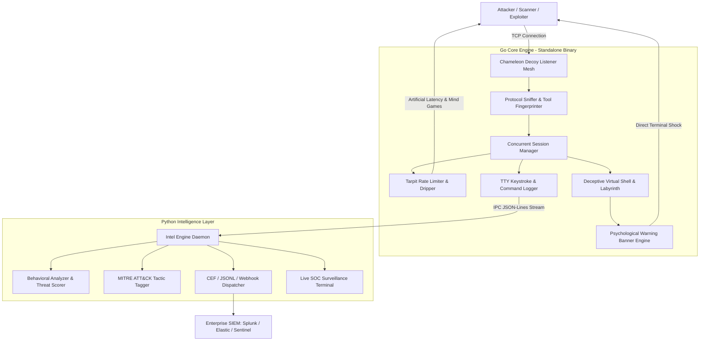

# Chameleon Honeypot — Enterprise Cyber Deception & Psychological Tarpit

```
   _____ _    _          __  __ ______ _      ______ ____  _   _ 
  / ____| |  | |   /\   |  \/  |  ____| |    |  ____/ __ \| \ | |
 | |    | |__| |  /  \  | \  / | |__  | |    | |__ | |  | |  \| |
 | |    |  __  | / /\ \ | |\/| |  __| | |    |  __|| |  | | . ' |
 | |____| |  | |/ ____ \| |  | | |____| |____| |___| |__| | |\  |
  \_____|_|  |_/_/    \_\_|  |_|______|______|______\____/|_| \_|
        Enterprise-Grade Cyber Deception & Psychological Tarpit
```
# 🦎 Chameleon Honeypot
## Enterprise Cyber Deception & Psychological Tarpit

**Chameleon Honeypot** is a next-generation, cross-platform cyber-deception and psychological countermeasure platform designed for **Linux and Windows**.

It combines a high-performance **Go network deception engine** with a **Python intelligence layer** to detect, classify, record, analyze, and manipulate attacker interactions inside a controlled deceptive environment.

The goal is simple:

> **Don't just detect the intruder — make the intruder interact with the deception.**

---

# 🚀 Key Capabilities

## 🔹 Go Core Engine

The Go engine provides the low-level, high-concurrency deception infrastructure.

- Concurrent TCP session handling
- Lightweight goroutine-based architecture
- Minimal runtime overhead
- Graceful shutdown and session management
- Standalone executable
- Multi-port decoy listener mesh
- Protocol detection
- Tool and scanner fingerprinting
- Interactive deceptive shell
- Tarpit and progressive latency
- TTY keystroke and command recording
- Psychological warning banners
- Honeytoken deception
- Fake filesystem paths
- Session telemetry
- JSONL event streaming

### Decoy Listener Mesh

Chameleon can expose multiple deceptive services:

| Port | Service |
|---:|---|
| `22` | SSH |
| `2222` | SSH Decoy |
| `23` | Telnet |
| `2323` | Telnet Decoy |
| `9999` | Custom Interactive Console |

---

# 🧠 Protocol & Tool Fingerprinting

Chameleon analyzes incoming connections and attempts to classify the behavior into categories such as:

- `AUTOMATED_SCANNER`
- `EXPLOIT_BOT`
- `HUMAN_INTERACTIVE`

The behavioral distinction allows Chameleon to react differently depending on how the attacker interacts with the honeypot.

### Automated Scanner

Examples include:

- Nmap
- Masscan
- ZGrab
- Shodan-style probing

### Exploit Bot

Characteristics include:

- Automated exploitation attempts
- Brute-force behavior
- Rapid command bursts
- Payload delivery
- Droppers
- Repetitive attack patterns

### Human Interactive

Characteristics include:

- Variable keystroke timing
- Pauses
- Manual exploration
- Interactive command execution
- Directory navigation
- Attempts to understand the environment

---

# 🪤 Tarpit Engine

Chameleon includes a dynamic tarpit designed to slow automated interaction while extending telemetry collection.

Instead of immediately rejecting suspicious connections, Chameleon can introduce:

- Controlled delays
- Progressive latency
- Artificial response timing
- Extended session lifetimes
- Deceptive responses

This provides additional time to observe attacker behavior.

---

# 🐚 Deceptive Virtual Shell

The interactive shell operates inside a simulated environment.

The attacker does **not** receive direct access to the underlying host.

Chameleon can present deceptive paths such as:

```text
/root/vault/sub_sector_3/quarantine
```

It can also expose fake sensitive files and honeytokens such as:

```text
id_rsa
/etc/shadow
database_production.conf
emergency_access.txt
```

Commands such as:

```text
exit
quit
rm -rf
reboot
```

are handled inside the simulated environment rather than being executed against the underlying host.

---

# 🧠 Python Intelligence Layer

The Python intelligence layer receives telemetry from the Go engine through an IPC JSON-lines stream.

It provides:

- Behavioral analysis
- Threat scoring
- MITRE ATT&CK mapping
- CEF generation
- JSONL intelligence events
- Webhook dispatching
- Live SOC monitoring

---

# 🎯 Threat Scoring

Each session receives a threat score from:

```text
0.0 → 10.0
```

The system can classify activity from:

```text
Low
Medium
High
Critical
```

Scoring considers factors such as:

- Command complexity
- Suspicious payloads
- Exploitation attempts
- Privilege escalation
- Reconnaissance
- File access
- Session interaction patterns
- Command frequency
- Behavioral characteristics

---

# 🎯 MITRE ATT&CK Mapping

Chameleon can associate observed attacker behavior with MITRE ATT&CK techniques.

Examples include:

| Technique | Description |
|---|---|
| `T1082` | System Information Discovery |
| `T1003` | OS Credential Dumping |
| `T1059` | Command and Scripting Interpreter |
| `T1105` | Ingress Tool Transfer |
| `T1070` | Indicator Removal |

This allows raw honeypot activity to become structured threat intelligence.

---

# 🧠 Psychological Countermeasures

Chameleon does not only record attackers.

It actively manipulates their perception of the environment.

## Shock Warning Banner

Interactive sessions can receive a psychological warning such as:

```text
================================================================================
[!] CRITICAL SYSTEM ALERT: ACTIVE PROFILING ENGAGED
================================================================================
[+] TIMESTAMP        : 2026-10-08 21:15:30 UTC
[+] INTRUDER IPv4    : <ATTACKER_TRUE_IP>
[+] ORIGIN PORT      : 54322
[+] PROTOCOL INGRESS : SSH-PROBE
[+] AUDIT SIGNATURE  : TRACE-NODE#7A9E21DF48
--------------------------------------------------------------------------------
[*] DYNAMIC ROUTE TRACING (LIVE HOP ANALYSIS):
    HOP 01: [INGRESS]    <ATTACKER_TRUE_IP>:54322 -> SYN_ACK CAPTURED
    HOP 02: [ISOLATION]  GATEWAY SINK-PROXY [HARDWARE TRAP ONLINE]
    HOP 03: [TELEMETRY]  PACKET DUMP & TTY BUFFER FORWARDED TO SOC/CSIRT
--------------------------------------------------------------------------------
>>> You're being watched — Tonight is the night <<<
--------------------------------------------------------------------------------
[!] FORENSIC ISOLATION ACTIVE. YOUR SESSION IS ARCHIVED IN REAL-TIME.
================================================================================
```

### Strict Banner Anonymity

The warning banner contains:

- No developer names
- No GitHub handles
- No personal attribution

Project attribution exists only in documentation and project metadata.

---

# 🌀 Psychological Deception Features

Chameleon includes several deception mechanisms:

### Progressive Latency

Artificial delays can be introduced progressively during suspicious interaction.

### Labyrinth Trap

Attackers can be redirected into deceptive filesystem structures such as:

```text
/root/vault/sub_sector_3/quarantine
```

### Honeytokens

Fake sensitive resources can be exposed:

```text
id_rsa
/etc/shadow
database_production.conf
emergency_access.txt
```

### Containment Deception

Dangerous-looking commands are processed inside the virtual environment rather than being executed against the real host.

---

# 🏗️ Architecture



---

# 📁 Project Structure

```text
chameleon-honeypot/
├── cmd/
│   └── chameleon/
│       └── main.go                 # Go CLI entrypoint & flag parser
│
├── internal/
│   ├── config/
│   │   └── config.go               # Configuration manager & defaults
│   │
│   ├── core/
│   │   ├── engine.go               # Master orchestrator & graceful shutdown
│   │   └── session.go              # Session registry & state tracking
│   │
│   ├── listener/
│   │   ├── listener.go             # High-concurrency TCP listener pool
│   │   ├── protocol_detector.go    # Protocol detection & fingerprinting
│   │   └── tarpit.go               # Streaming tarpit & rate limiter
│   │
│   ├── deception/
│   │   ├── banner.go               # Psychological warning generator
│   │   ├── mindgames.go            # Labyrinths, honeytokens & fake outputs
│   │   └── shell.go                # Deceptive interactive shell
│   │
│   ├── profiler/
│   │   ├── fingerprint.go          # Scanner vs human behavior analysis
│   │   └── tty_logger.go           # Keystroke-level forensic recorder
│   │
│   └── ipc/
│       └── streamer.go              # IPC bridge to Python
│
├── python_intel/
│   ├── intel_engine.py             # Python intelligence daemon
│   ├── behavioral_analyzer.py      # Behavioral scoring & ATT&CK mapping
│   ├── alert_dispatcher.py         # CEF/SIEM & webhook dispatcher
│   ├── terminal_monitor.py         # Live SOC surveillance console
│   └── tests/
│       └── test_intel.py           # Python intelligence tests
│
├── config/
│   └── config.json                 # Deployment configuration
│
├── deploy/
│   ├── chameleon.service           # Linux systemd service
│   ├── run_chameleon.sh            # Linux daemon manager
│   ├── run_chameleon.bat           # Windows launcher
│   └── install_windows_service.ps1 # Windows service installer
│
├── test/
│   ├── attacker_simulator.py       # Automated attacker simulator
│   └── honeypot_test.go            # Go test suite
│
├── Makefile                        # Build & test automation
└── README.md                       # Project documentation
```

---

# ⚙️ Prerequisites

Before installing Chameleon, make sure you have:

- **Go 1.22+**
- **Python 3.10+**
- **Git**
- **Make**

The Python intelligence layer uses the Python standard library and does not require external `pip` dependencies.

---

# 🚀 How to Install and Run (Step-by-Step for Beginners)

If this is your first time using Go or GitHub projects, don't worry! Just follow these simple steps.

## Step 1: Download the Project to Your Computer

Open your terminal on Linux or PowerShell on Windows and type:

```bash
git clone https://github.com/cys-dexter/chameleon-honeypot.git
cd chameleon-honeypot
```

---

## Step 2: Check the Requirements

Make sure the required tools are installed:

```bash
go version
python3 --version
git --version
make --version
```

You should have:

```text
Go     1.22+
Python 3.10+
Git
Make
```

---

## Step 3: Build the Program (Compile)

This step turns the source code into a ready-to-run program.

Make sure **Go** is installed before running the build command.

```bash
make build
```

This creates the executable inside:

```text
bin/chameleon
```

On Windows, the executable is:

```text
bin/chameleon.exe
```

You can also build for multiple platforms:

```bash
make build-all
```

Or build individually:

```bash
make build-linux
make build-windows
```

Expected output:

```text
bin/chameleon-linux-amd64
bin/chameleon-windows-amd64.exe
```

---

## Step 4: Run It!

### 🐧 Linux

Start the honeypot with:

```bash
./bin/chameleon -c config/config.json
```

### 🪟 Windows

Open Command Prompt or PowerShell in the project folder and run:

```powershell
bin\chameleon.exe -c config\config.json
```

Keep the terminal running while testing the honeypot.

---

## Step 5: Test If It Works

Open a **second terminal window** on your computer.

Run the built-in attacker simulator:

```bash
python3 test/attacker_simulator.py 9999 127.0.0.1
```

The simulator allows you to test Chameleon's deception and telemetry locally without needing a real external attacker.

---

## Step 6: Watch Chameleon Detect the Connection

When the simulator connects, Chameleon should begin producing telemetry such as:

- Connection detection
- Attacker IP
- Protocol detection
- Tool classification
- Session tracking
- Command/interaction recording
- Threat scoring
- MITRE ATT&CK mapping
- Tarpit behavior
- Psychological warning banner

The generated evidence is stored inside the `logs/` directory.

---

# 🧪 Testing

Run the complete test suite:

```bash
make test
```

Go race-enabled tests:

```bash
go test -v -race ./test/...
```

Python intelligence tests:

```bash
python3 -m unittest discover -s python_intel/tests
```

---

# 🕵️ Attacker Simulator

The built-in simulator can be launched with:

```bash
python3 test/attacker_simulator.py 9999 127.0.0.1
```

It verifies different behavioral scenarios.

### Automated Scanner

Expected classification:

```text
AUTOMATED_SCANNER
```

### Exploit Bot

Expected behavior:

```text
EXPLOIT_BOT
```

with behavioral and MITRE telemetry.

### Human Interactive Session

The simulator can trigger interactive deception such as:

```text
You're being watched — Tonight is the night
```

along with:

- Attacker IP telemetry
- Session recording
- Tarpit delays
- Behavioral analysis

---

# 📝 Logs & Evidence

Chameleon stores telemetry and forensic evidence under:

```text
logs/
├── chameleon_events.jsonl
├── evidence_intel.jsonl
├── siem_events.cef
└── sessions/
    └── <session_id>.log
```

### `chameleon_events.jsonl`

Real-time event stream generated by the Go engine.

### `sessions/<session_id>.log`

Forensic session records including:

- Commands
- Interaction telemetry
- Session activity

### `evidence_intel.jsonl`

Python intelligence output containing:

- Behavioral intelligence
- Threat scores
- MITRE mappings

### `siem_events.cef`

CEF records designed for SIEM ingestion.

---

# 📺 Live SOC Monitoring

Start the live SOC surveillance terminal with:

```bash
python3 python_intel/terminal_monitor.py logs
```

The terminal can display:

- Attacker IP
- Session ID
- Commands
- Keystroke activity
- Tool classification
- Threat score
- MITRE ATT&CK tags

---

# 🕒 How to Run 24/7 (Always-On Background Service)

If you want Chameleon to run continuously in the background, even after closing the terminal or restarting the server, follow the instructions for your operating system.

---

## 🐧 Linux — Using systemd

To make Linux run the honeypot automatically as a background service:

### 1. Create the installation folder and copy the files

```bash
sudo mkdir -p /opt/chameleon-honeypot/bin
sudo cp bin/chameleon /opt/chameleon-honeypot/bin/
sudo cp -r config /opt/chameleon-honeypot/
```

### 2. Copy the pre-made service file to systemd

```bash
sudo cp deploy/chameleon.service /etc/systemd/system/
```

### 3. Enable and start the service

```bash
sudo systemctl daemon-reload
sudo systemctl enable --now chameleon.service
```

### 4. Check if it is running

```bash
sudo systemctl status chameleon.service
```

The service will now be managed by systemd.

---

## 🐧 Linux — Daemon Manager

Chameleon also includes a helper script:

```bash
./deploy/run_chameleon.sh start
```

Check status:

```bash
./deploy/run_chameleon.sh status
```

Stop the service:

```bash
./deploy/run_chameleon.sh stop
```

---

## 🪟 Windows — Using Windows Service

To make Windows run Chameleon automatically in the background as a system service:

### 1. Open PowerShell as Administrator

Right-click PowerShell and select:

```text
Run as Administrator
```

### 2. Go into your project folder

```powershell
cd path\to\chameleon-honeypot
```

### 3. Run the built-in installer script

```powershell
.\deploy\install_windows_service.ps1 -Action install
```

### 4. Check if the service is running

```powershell
Get-Service -Name ChameleonHoneypot
```

### Uninstall the Windows service

If you want to remove the service later:

```powershell
.\deploy\install_windows_service.ps1 -Action uninstall
```

---

# 🔧 Custom Ports

You can override the default ports when launching Chameleon.

For example:

```bash
./bin/chameleon -p 2222,2323,9999
```

This allows you to define the decoy listener ports directly from the command line.

---

# 🌐 Deployment Architecture

For real deployments, Chameleon should be isolated from sensitive infrastructure.

Recommended architecture:

```text
Internet
    │
    ▼
Firewall / Gateway
    │
    ▼
Chameleon Honeypot
    │
    ▼
SOC / SIEM / CSIRT
```

The honeypot should not have unrestricted access to sensitive host resources.

---

# 🔄 Telemetry Flow

```text
Attacker
   │
   ▼
Decoy Listener
   │
   ▼
Session Manager
   │
   ├──► Protocol Detection
   │
   ├──► Tool Fingerprinting
   │
   ├──► TTY Recording
   │
   └──► Deceptive Shell
            │
            ▼
      JSONL IPC Stream
            │
            ▼
    Python Intelligence
            │
      ┌─────┼─────────┐
      ▼     ▼         ▼
   Threat  MITRE     Alerts
   Score   Mapping   / CEF
      │     │         │
      └─────┴─────────┘
              │
              ▼
          SOC / SIEM
```

---

# 🛡️ Security Philosophy

> **Don't just detect the intruder — make the intruder interact with the deception.**

Chameleon is designed around the idea that attacker interaction itself is valuable telemetry.

Instead of simply rejecting suspicious connections, the platform can:

1. Detect the connection.
2. Identify the protocol.
3. Fingerprint the tool or interaction style.
4. Track the session.
5. Record commands and keystrokes.
6. Introduce deception.
7. Apply controlled latency.
8. Analyze behavior.
9. Map activity to MITRE ATT&CK.
10. Generate structured intelligence for the SOC/SIEM.

---

# ⚠️ Responsible Use

Chameleon is intended for authorized defensive and research environments, including:

- Authorized security research
- Defensive monitoring
- Honeypot deployments
- Malware and attacker-behavior analysis
- SOC/CSIRT laboratories
- Network defense labs
- Controlled penetration testing

**Only deploy Chameleon on systems and networks where you have explicit authorization to do so.**

---

# 👤 Project Metadata

**Project:** Chameleon Honeypot  
**Creator:** Ahmad  
**Security Identity:** CYS-Dexter  
**GitHub:** `cys-dexter`

**Repository:**

```text
https://github.com/cys-dexter/chameleon-honeypot
```

---

# ⚡ Quick Start — TL;DR

For a quick local installation:

```bash
git clone https://github.com/cys-dexter/chameleon-honeypot.git
cd chameleon-honeypot
make build
./bin/chameleon -c config/config.json
```

Then, from another terminal:

```bash
python3 test/attacker_simulator.py 9999 127.0.0.1
```

For 24/7 Linux operation:

```bash
sudo mkdir -p /opt/chameleon-honeypot/bin
sudo cp bin/chameleon /opt/chameleon-honeypot/bin/
sudo cp -r config /opt/chameleon-honeypot/
sudo cp deploy/chameleon.service /etc/systemd/system/
sudo systemctl daemon-reload
sudo systemctl enable --now chameleon.service
sudo systemctl status chameleon.service
```

---

# 🦎 Final

Chameleon is now ready to operate as a controlled cyber-deception sensor, providing behavioral telemetry, session evidence, active tool classification, and threat intelligence for defensive analysis.
