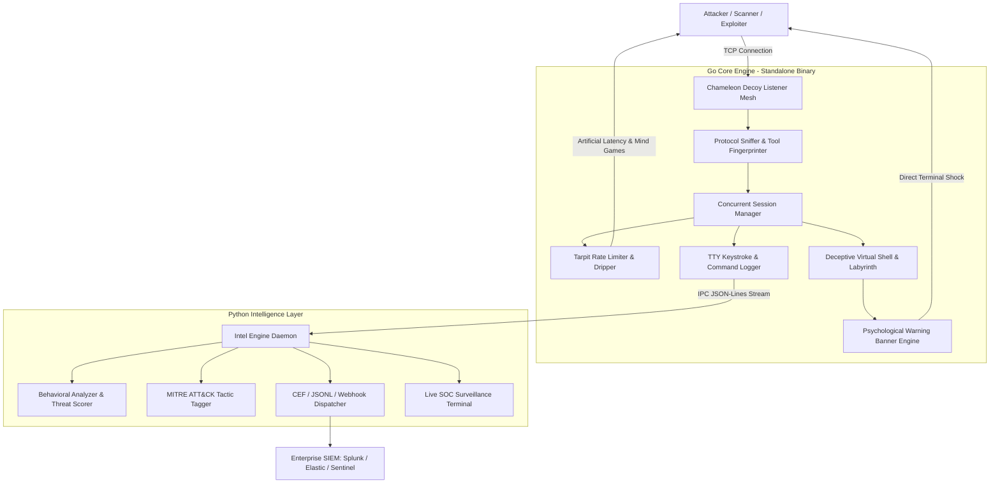

# Chameleon Honeypot — Enterprise Cyber Deception & Psychological Tarpit

```
   _____ _    _          __  __ ______ _      ______ ____  _   _ 
  / ____| |  | |   /\   |  \/  |  ____| |    |  ____/ __ \| \ | |
 | |    | |__| |  /  \  | \  / | |__  | |    | |__ | |  | |  \| |
 | |    |  __  | / /\ \ | |\/| |  __| | |    |  __|| |  | | . ' |
 | |____| |  | |/ ____ \| |  | | |____| |____| |___| |__| | |\  |
  \_____|_|  |_/_/    \_\_|  |_|______|______|______\____/|_| \_|
        Enterprise-Grade Cyber Deception & Psychological Tarpit
```
# 🦎 Chameleon Honeypot — Enterprise Cyber Deception & Psychological Tarpit

**Chameleon** is a next-generation cross-platform **Linux & Windows cyber deception and psychological countermeasure platform**. Built with a dual-language hybrid architecture, Chameleon combines low-level networking performance with advanced behavioral intelligence, active deception, and psychological countermeasures.

> **Creator:** Ahmad  
> **Security Identity:** CYS-Dexter  
> **GitHub:** cys-dexter

---

## Architecture Overview



---

# ⚙️ Go Core Engine

The Go engine provides the low-level networking and session-management layer.

### High Concurrency

- Concurrent TCP session handling
- Lightweight goroutines
- Minimal runtime overhead
- Graceful shutdown and session management
- Standalone executable deployment

### Multi-Port Decoy Mesh

Chameleon can expose multiple deceptive services simultaneously, including:

- SSH-style listeners
- Telnet-style listeners
- Custom interactive consoles
- Configurable custom ports

Example:

```text
22    → SSH deception
2222  → Alternate SSH deception
23    → Telnet deception
2323  → Alternate Telnet deception
9999  → Interactive custom console
```

### Protocol & Tool Fingerprinting

The engine observes connection behavior, probes, payload patterns, command sequences, and timing characteristics to help distinguish between:

```text
AUTOMATED_SCANNER
EXPLOIT_BOT
HUMAN_INTERACTIVE
```

### Dynamic Tarpit

Instead of immediately terminating suspicious sessions, Chameleon can introduce controlled delays and progressively slower responses.

This can:

- Consume attacker or scanner resources
- Slow automated interaction
- Increase session duration
- Generate additional behavioral telemetry
- Provide analysts with more observable activity

---

# 🧠 Python Intelligence Layer

The Python layer processes behavioral telemetry generated by the Go engine.

## Real-Time Threat Scoring

Each session can receive a dynamic threat score:

```text
0.0 ───────────────────────────── 10.0
Low                              Critical
```

Scoring can consider:

- Command complexity
- Suspicious payloads
- Exploitation attempts
- Privilege escalation behavior
- Reconnaissance activity
- File access attempts
- Session interaction patterns

---

## 🔍 Attacker Classification

Chameleon analyzes interaction behavior to classify potential attackers as:

### `AUTOMATED_SCANNER`

Examples include:

- Nmap
- Masscan
- ZGrab
- Shodan-style probing

### `EXPLOIT_BOT`

Examples include:

- Automated exploit payloads
- Droppers
- Brute-force automation
- Rapid command bursts

### `HUMAN_INTERACTIVE`

Behavior can include:

- Variable keystroke timing
- Typing pauses
- Interactive command sequences
- Manual exploration

---

# 🧬 MITRE ATT&CK Mapping

Suspicious activity can be mapped to relevant MITRE ATT&CK techniques.

| Technique | Description |
|---|---|
| `T1082` | System Information Discovery |
| `T1003` | OS Credential Dumping |
| `T1059` | Command and Scripting Interpreter |
| `T1105` | Ingress Tool Transfer |
| `T1070` | Indicator Removal |

The resulting telemetry can be forwarded to security monitoring infrastructure for further analysis.

---

# 🧠 Psychological Countermeasures & Active Deception

Chameleon is designed not only to detect interaction, but also to create a convincing deceptive environment.

## 1. Immediate Psychological Shock

The system can display a warning when suspicious interaction begins:

```text
================================================================================
[!] CRITICAL SYSTEM ALERT: ACTIVE PROFILING ENGAGED
================================================================================
[+] TIMESTAMP        : 2026-10-08 21:15:30 UTC
[+] INTRUDER IPv4    : <ATTACKER_TRUE_IP>
[+] ORIGIN PORT      : 54322
[+] PROTOCOL INGRESS : SSH-PROBE
[+] AUDIT SIGNATURE  : TRACE-NODE#7A9E21DF48
--------------------------------------------------------------------------------
[*] DYNAMIC ROUTE TRACING (LIVE HOP ANALYSIS):
    HOP 01: [INGRESS]    <ATTACKER_TRUE_IP>:54322 -> SYN_ACK CAPTURED
    HOP 02: [ISOLATION]  GATEWAY SINK-PROXY [HARDWARE TRAP ONLINE]
    HOP 03: [TELEMETRY]  PACKET DUMP & TTY BUFFER FORWARDED TO SOC/CSIRT
--------------------------------------------------------------------------------
>>> You're being watched — Tonight is the night <<<
--------------------------------------------------------------------------------
[!] FORENSIC ISOLATION ACTIVE. YOUR SESSION IS ARCHIVED IN REAL-TIME.
================================================================================
```

### Strict Banner Anonymity

The psychological warning banner itself contains:

- No developer names
- No GitHub handles
- No personal attribution

Project attribution remains exclusively in the documentation and project metadata.

---

# 🕳️ Tarpit & Deception Mechanics

## Progressive Latency

The system can introduce controlled response delays that increase as the session continues.

## Labyrinth Traps

Deceptive directory structures can create the appearance of a larger environment:

```text
/root/vault/sub_sector_3/quarantine
```

## Honeytoken Bait Files

Example deceptive targets:

```text
id_rsa
/etc/shadow
database_production.conf
emergency_access.txt
```

These can be used as interaction triggers and telemetry sources.

## Containment Deception

Potentially destructive commands can be intercepted and handled inside the simulated environment rather than being executed against the underlying host.

Examples:

```text
exit
quit
rm -rf
reboot
```

---

# 📁 Project Structure

```text
chameleon-honeypot/
├── cmd/
│   └── chameleon/
│       └── main.go                 # Go CLI entrypoint & flag parser
│
├── internal/
│   ├── config/
│   │   └── config.go               # Configuration manager & defaults
│   │
│   ├── core/
│   │   ├── engine.go               # Master orchestrator & graceful shutdown
│   │   └── session.go              # Session registry & state tracking
│   │
│   ├── listener/
│   │   ├── listener.go             # High-concurrency TCP listener pool
│   │   ├── protocol_detector.go    # Protocol detection & fingerprinting
│   │   └── tarpit.go               # Streaming tarpit & rate limiter
│   │
│   ├── deception/
│   │   ├── banner.go               # Psychological warning generator
